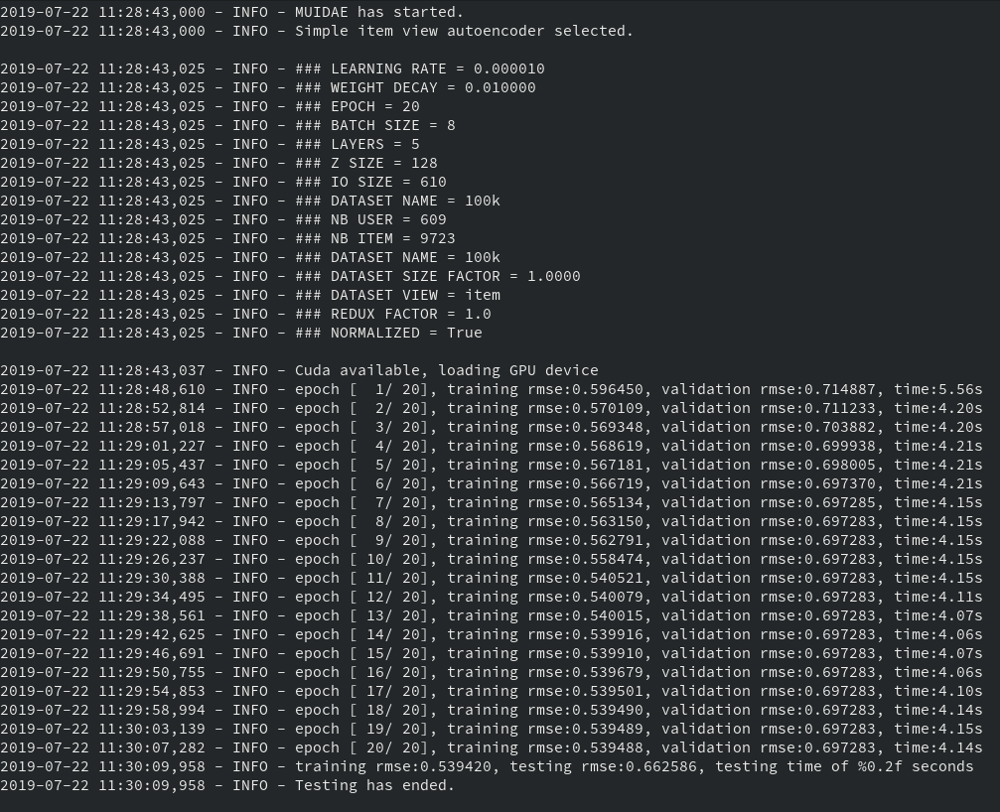

# MUIDAE - Mixed User Item Deep AutoEncoder

MUIDAE is a collaborative filtering recommendation system based on a Deep AutoEncoder Neural Network architecture.

The dataset can be processed by the Autoencoder either using the user view (rows as input) or item view (column as input).

To give it a shot, for example:

````
    git clone https://github.com/victordeleau/muidae
    cd muidae/
    conda create -f env.yml
    conda activate muidae
    cd muidae/
    clear && python3 main.py --view item --normalize --zsize 32 --batch_size 8 --normalize --redux 1 --learning_rate 0.0001
````


The CLI interface :

